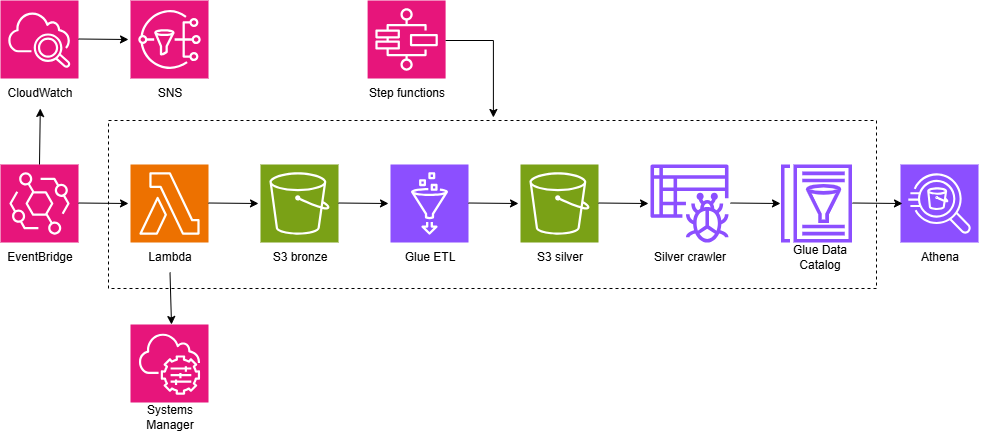
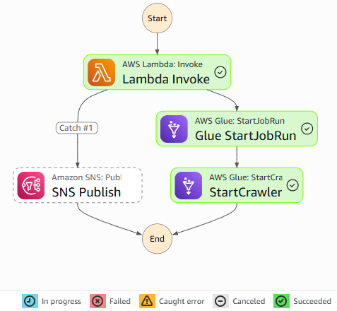
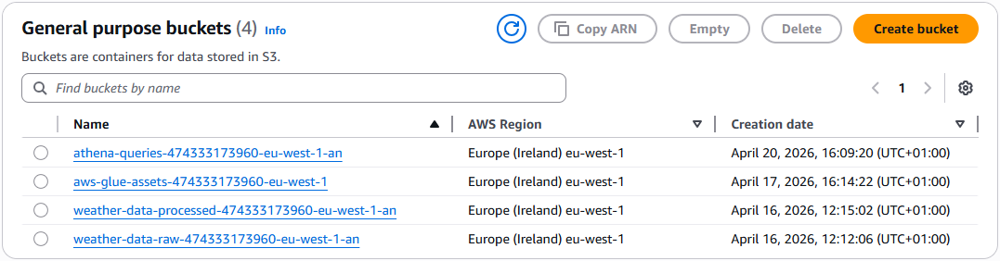
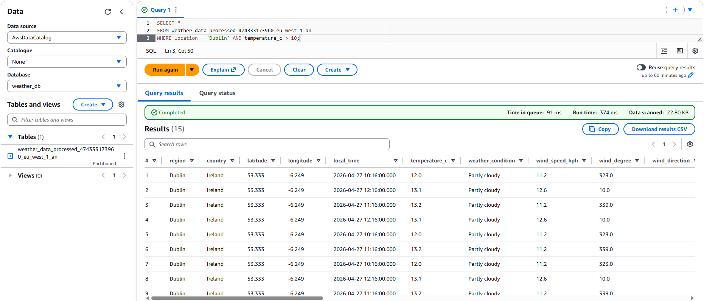

# Serverless AWS WeatherAPI ETL Pipeline

## 1. Architecture Overview
This project implements a fully serverless ETL pipeline on AWS that ingests weather data from an external API, processes it, and makes it queryable for analytics.
**Core components:**
- **Ingestion:** AWS Lambda (Python) triggered by EventBridge fetching data from WeatherAPI.  
- **Storage:** Amazon S3 using a Medallion Architecture (Raw/Bronze $\rightarrow$ Processed/Silver).  
- **Processing:** AWS Glue (PySpark) performing schema enforcement and Parquet conversion.  
- **Orchestration:** AWS Step Functions managing the workflow dependencies.  
- **Analytics:** Amazon Athena for serverless SQL querying.

## 2. Bronze Layer (Data Ingestion)
**Service:** AWS Lambda (Python 3.14).  
**Security:** API Keys stored securely in AWS Systems Manager (SSM) Parameter Store.  
**Partitioning Strategy:** Implemented Hive-style partitioning in S3:  
`place=P/year=Y/month=M/day=D/`  
This enables efficient querying and automatic partition discovery.  
**Key Challenge:** Initially encountered issues with simple folder paths; pivoted to Hive-style keys to enable automatic partition discovery in Spark.  

## 3. Silver Layer (Processing)
**Service:** AWS Glue ETL (PySpark).  
- **Key Engineering Decisions:**  
  - **Manual Schema Definition:** Defined schema using `StructType` to enforce data quality and handle nested JSON structures (e.g. air quality, location).  
  - **Direct S3 Reading:** Bypassed the Data Catalog for the ETL input to eliminate metadata lag and reduce crawler dependency.  
  - **File Format:** Converted raw JSON to Apache Parquet with Snappy compression to reduce storage costs and increase Athena query speed.  

## 4. Orchestration
**Service:** AWS Step Functions.  
**Logic Flow:** Lambda $\rightarrow$ Glue ETL $\rightarrow$ Silver Crawler.  
**Observability:** Integrated Amazon SNS to send real-time email alerts upon pipeline failure.  

## 5. Challenges & Solutions
**Challenge:** Schema Collision.  
**Solution:** Encountered a naming conflict between S3 partition keys and nested JSON fields (location). Resolved by renaming the internal Spark DataFrame alias to place.  

**Challenge:** Step Functions stalled indefinitely using "Wait for callback" (the Crawler doesn't support this). Conversely, unticking it caused the ETL job to read stale metadata before the Crawler finished.  
**Solution:** Pivoted to a decoupled architecture - bypassed the Bronze Crawler entirely by implementing a Manual Schema (StructType) in Spark. This allowed the ETL job to read directly from S3, ensuring 100% data consistency and less execution time.  

## 6. How to Run
### Prerequisites
- AWS Account (Free Tier sufficient).
- WeatherAPI key from [weatherapi.com](https://www.weatherapi.com/).

### Step 1: Budget Setup
- Create a budget in AWS Billing to monitor costs.

### Step 2: Secure Configuration
- Create parameter named `/weather/api-key` in SSM Parameter Store.
- Store API key as a `SecureString`.

### Step 3: Storage Setup
- Create the following buckets:
  - bronze layer bucket to store a raw JSON response from API calls: `weather-data-raw`;
  - silver layer bucket for processed data in Parquet format: `weather-data-processed`;
  - bucket for Amazon Athena queries to separate from data layers: `athena-queries`;
- Create and attach an IAM policy for bucket access.

### Step 4: Lambda (Ingestion)
- Create IAM role with S3 access permission.
- Create Lambda function: `weather-ingestion-engine` (Python 3.14).
- Add dependencies (e.g. `requests` layer).
- Set environment variable `WEATHER_BRONZE_BUCKET_NAME`.
- Use code from `ingestion.py` file.

### Step 5: Set up messaging
- Create SNS topic.
- Subscribe using custom emails.

### Step 6: Set up CloudWatch
- Create CloudWatch alarm send notifications to the topic.
- Optionally create a dashboard to track errors.

### Step 7: Processing Silver-Layer
- Create Glue ETL job using code from `transform_silver.py` file.
- Set the job to read from bronze layer bucket and save into silver layer bucket.
- Create a Glue database named `weather_db`.
- Create a Glue crawler to read from silver bucket.

### Step 8: Orchestration with Step Functions
- Create state machine.
- Use definition from `definition.json` file.

### Step 9: Schedule Runs
- Use EventBridge to trigger pipeline periodically.

### Step 10: Query with Athena
- Use Amazon Athena to query processed data from `weather_db` database.

